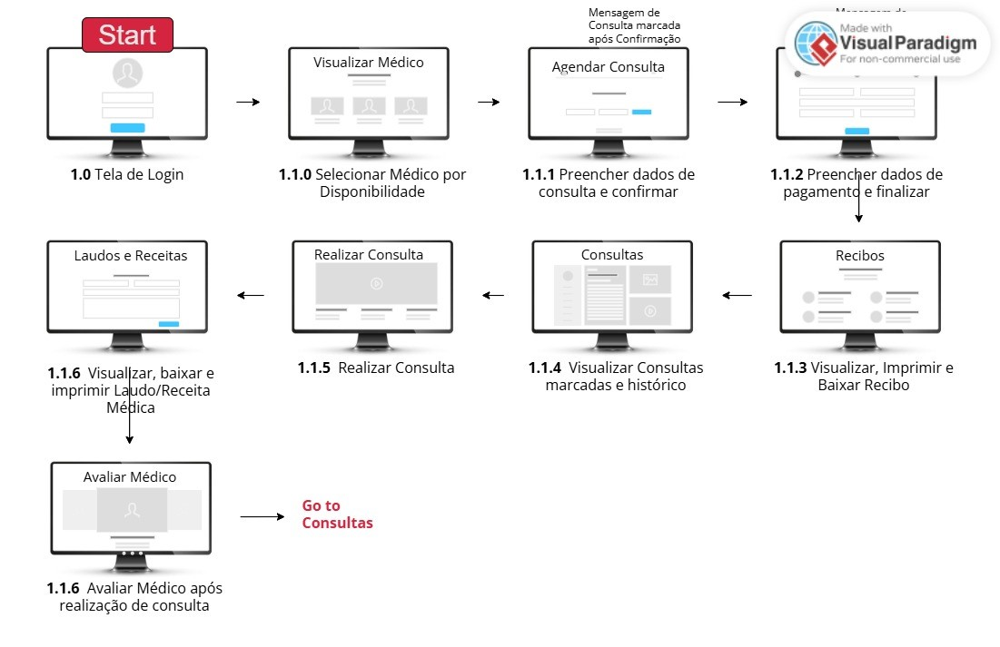
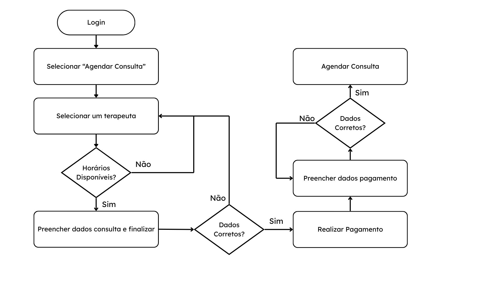

# Projeto de interface - Simplifica Terapia

<!-- Pré-requisitos: <a href="02-Especificacao.md"> Especificação do projeto</a>

Visão geral da interação do usuário pelas telas do sistema e protótipo interativo das telas com as funcionalidades que fazem parte do sistema (wireframes).

 Apresente as principais interfaces da plataforma. Discuta como ela foi elaborada de forma a atender os requisitos funcionais, não funcionais e histórias de usuário abordados na <a href="02-Especificacao.md"> Especificação do projeto</a>. -->

 ### Problema Identificado
 O acesso à terapia enfrenta obstáculos como a escassez de profissionais, altos custos e dificuldades logísticas para pacientes. Ao mesmo tempo, terapeutas precisam de sistemas eficientes para gerenciar consultas, finanças e documentação.

### Ideia de Solução:
O Simplifica Terapia é uma plataforma digital que conecta pacientes a terapeutas, oferecendo funcionalidades como agendamento de consultas, geração de laudos e receitas eletrônicas, organização de agenda e pagamentos online.

A solução visa facilitar o acesso à saúde mental, com atendimento prático, seguro e eficiente.

### Técnicas e Ferramentas utilizadas na especificação:
> - Diagrama de Personas
> - Histórias de Usuário
> - Requisitos Funcionais e Não Funcionais
> - Diagrama de Casos de Uso
> - Metodologia Ágil

### Visão Geral da Interação do Usuário pelas Telas do Sistema
O Simplifica Terapia oferece uma navegação simples, permitindo que o usuário realize todas as ações principais com poucos cliques:

> - Login/Cadastro de Paciente ou Terapeuta
> - Agendamento de Consultas
> - Gerenciamento de Laudos e Receitas
> - Realização de Pagamentos Online
> - Avaliação dos Profissionais

As interfaces foram elaboradas para atender a:

> - Requisitos Funcionais (como agendar consulta, gerar receita, visualizar laudo)
> - Requisitos Não Funcionais (privacidade dos dados, tempo de resposta rápido, UX amigável)
> - Histórias de Usuário (atendendo às necessidades específicas de Ana, Carlos e Mariana)

 ## User flow

<!-- Fluxo de usuário (user flow) é uma técnica que permite ao desenvolvedor mapear todo o fluxo de navegação do usuário na aplicação. Essa técnica serve para alinhar os caminhos e as possíveis ações que o usuário pode realizar junto com os membros da equipe.

> **Links úteis**:
> - [User flow: o quê é e como fazer?](https://medium.com/7bits/fluxo-de-usu%C3%A1rio-user-flow-o-que-%C3%A9-como-fazer-79d965872534)
> - [User flow vs site maps](http://designr.com.br/sitemap-e-user-flow-quais-as-diferencas-e-quando-usar-cada-um/)
> - [Top 25 user flow tools & templates for smooth](https://www.mockplus.com/blog/post/user-flow-tools) -->
O User Flow mapeia todos os caminhos possíveis que o usuário percorre dentro da aplicação, garantindo uma jornada fluida e sem obstáculos.

### Fluxo - Agendar Consulta:
> - Login → Menu Principal → Agendar Consulta → Escolher Terapeuta → Preencher Dados → Confirmar Agendamento → Realizar Pagamento

Essa estrutura assegura que o sistema atenda tanto os requisitos funcionais (RF) quanto as histórias de usuários levantadas.

### Diagrama de fluxo

<!-- O diagrama apresenta o estudo do fluxo de interação do usuário com o sistema interativo, muitas vezes sem a necessidade de desenhar o design das telas da interface. Isso permite que o design das interações seja bem planejado e tenha impacto na qualidade do design do wireframe interativo que será desenvolvido logo em seguida.

O diagrama de fluxo pode ser desenvolvido com “boxes” que possuem, internamente, a indicação dos principais elementos de interface — tais como menus e acessos — e funcionalidades, como editar, pesquisar, filtrar e configurar, além da conexão entre esses boxes a partir do processo de interação.

> **Links úteis**:
> - [Como criar um diagrama de fluxo de usuário](https://www.lucidchart.com/blog/how-to-make-a-user-flow-diagram)
> - [Fluxograma online: seis sites para fazer gráfico sem instalar nada](https://www.techtudo.com.br/listas/2019/03/fluxograma-online-seis-sites-para-fazer-grafico-sem-instalar-nada.ghtml) -->

O Diagrama de Fluxo foi desenvolvido para representar de maneira lógica a interação do usuário com o Simplifica Terapia, antes da construção visual das telas.

Esse mapeamento garantiu que a criação dos wireframes e a arquitetura da plataforma fossem pensados para oferecer uma experiência intuitiva.

## Wireframes

<!-- São protótipos usados no design de interface para sugerir a estrutura de um site web e seu relacionamento entre suas páginas. Um wireframe web é uma ilustração que mostra o layout dos elementos fundamentais na interface.

 
> **Links úteis**:
> - [Protótipos: baixa, média ou alta fidelidade?](https://medium.com/ladies-that-ux-br/prot%C3%B3tipos-baixa-m%C3%A9dia-ou-alta-fidelidade-71d897559135)
> - [Protótipos vs wireframes](https://www.nngroup.com/videos/prototypes-vs-wireframes-ux-projects/)
> - [Ferramentas de wireframes](https://rockcontent.com/blog/wireframes/)
> - [MarvelApp](https://marvelapp.com/developers/documentation/tutorials/)
> - [Figma](https://www.figma.com/)
> - [Adobe XD](https://www.adobe.com/br/products/xd.html#scroll)
> - [Axure](https://www.axure.com/edu) (Licença Educacional)
> - [InvisionApp](https://www.invisionapp.com/) (Licença Educacional) -->

## Interface do sistema

Visão geral da interação do usuário por meio das telas do sistema. 

> Apresente as principais interfaces da plataforma em sua versão final.
