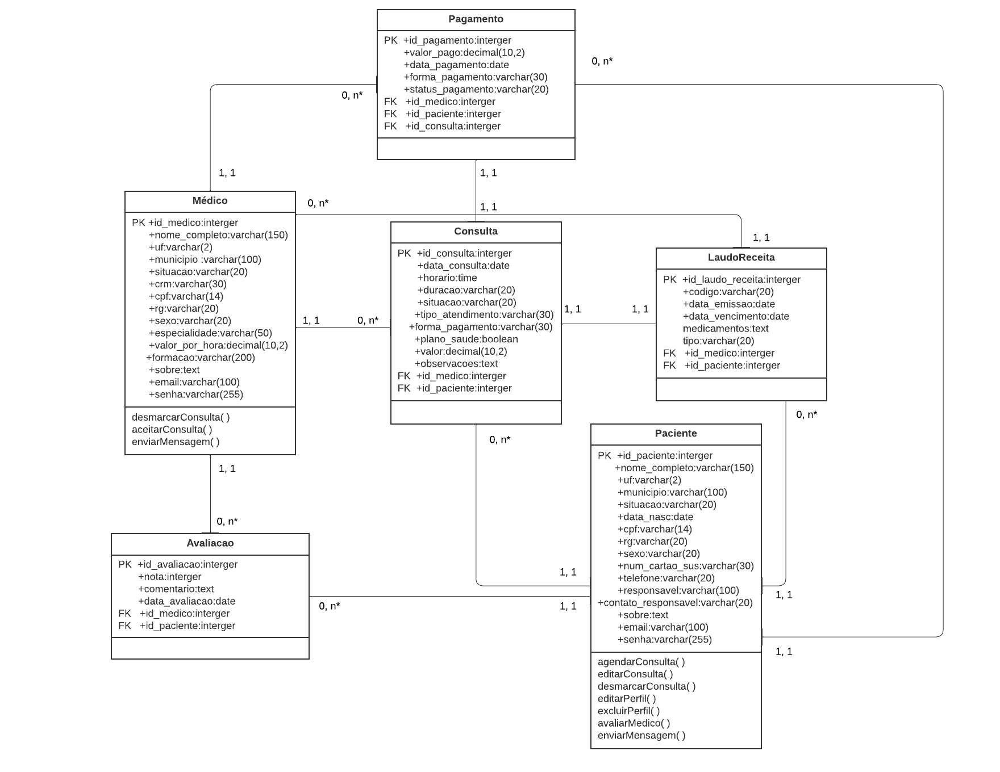

# Arquitetura da solução - Simplifica Terapia

<!-- <span style="color:red">Pré-requisitos: <a href="04-Projeto-interface.md"> Projeto de interface</a></span>

Definição de como o software é estruturado em termos dos componentes que fazem parte da solução e do ambiente de hospedagem da aplicação.

 -->
A construção da arquitetura do Simplifica Terapia foi fundamentada no projeto de interface previamente desenvolvido, garantindo que todos os componentes da solução fossem planejados para oferecer uma experiência prática, segura e acessível para pacientes e terapeutas.

### Arquitetura da Solução

A solução foi estruturada em três grandes camadas:

> - Front-end: Responsável pela interação do usuário com o sistema.
> - Back-end: Responsável pelo processamento das informações e regras de negócio.
> - Banco de Dados: Armazena as informações dos usuários, consultas, laudos, receitas e pagamentos.

A aplicação será hospedada em ambiente online, garantindo alta disponibilidade e acesso seguro para os usuários.

## Diagrama de classes

<!-- O diagrama de classes ilustra graficamente a estrutura do software e como cada uma das classes estará interligada. Essas classes servem de modelo para materializar os objetos que serão executados na memória.

> **Links úteis**:
> - [Diagramas de classes - documentação da IBM](https://www.ibm.com/docs/pt-br/rational-soft-arch/9.7.0?topic=diagrams-class)
> - [O que é um diagrama de classe UML?](https://www.lucidchart.com/pages/pt/o-que-e-diagrama-de-classe-uml) -->
O diagrama de classes do Simplifica Terapia ilustra a estrutura do sistema, representando:

> - Entidades: Usuário, Paciente, Terapeuta, Consulta, Pagamento, Laudo/Receita e Avaliação.
> - Relacionamentos: Entre pacientes, terapeutas e suas interações no sistema.

O modelo de classes foi desenvolvido para atender os requisitos funcionais e garantir integridade dos dados durante a execução do sistema.

## Modelo de dados

<!-- O desenvolvimento da solução proposta requer a existência de bases de dados que permitam realizar o cadastro de dados e os controles associados aos processos identificados, assim como suas recuperações.

Utilizando a notação do DER (Diagrama Entidade-Relacionamento), elabore um modelo, usando alguma ferramenta, que contemple todas as entidades e atributos associados às atividades dos processos identificados. Deve ser gerado um único DER que suporte todos os processos escolhidos, visando, assim, uma base de dados integrada. O modelo deve contemplar também o controle de acesso dos usuários (partes interessadas nos processos) de acordo com os papéis definidos nos modelos do processo de negócio.

Apresente o modelo de dados por meio de um modelo relacional que contemple todos os conceitos e atributos apresentados na modelagem dos processos. -->
Diagrama Entidade-Relacionamento (DER)
O modelo DER do Simplifica Terapia foi criado considerando:

> - Cadastro de pacientes e terapeutas.
> - Controle de consultas, receitas e laudos.
> - Controle de pagamentos e avaliações.

O DER integra todas as funcionalidades descritas nas histórias de usuários, respeitando a segurança e privacidade dos dados.

### Controle de acesso:
Usuários terão perfis distintos (paciente ou terapeuta) e acesso restrito conforme suas permissões.

### Modelo ER

O Modelo ER representa, por meio de um diagrama, como as entidades (coisas, objetos) se relacionam entre si na aplicação interativa.

<!-- > **Links úteis**:
> - [Como fazer um diagrama entidade relacionamento](https://www.lucidchart.com/pages/pt/como-fazer-um-diagrama-entidade-relacionamento) -->

### Esquema relacional

O Esquema Relacional corresponde à representação dos dados em tabelas juntamente com as restrições de integridade e chave primária.


 

<!-- 
---

> **Links úteis**:
> - [Criando um modelo relacional - documentação da IBM](https://www.ibm.com/docs/pt-br/cognos-analytics/12.0.0?topic=designer-creating-relational-model) -->

### Modelo físico

<!--Insira aqui o script de criação das tabelas do banco de dados.

Veja um exemplo: -->

```sql
CREATE TABLE Medico (
    id_medico INT PRIMARY KEY AUTO_INCREMENT,
    nome_completo VARCHAR(150),
    uf VARCHAR(2),
    municipio VARCHAR(100),
    situacao VARCHAR(20),
    crm VARCHAR(30),
    cpf VARCHAR(14) UNIQUE,
    rg VARCHAR(20),
    sexo VARCHAR(20),
    especialidade VARCHAR(100),
    valor_por_hora DECIMAL(10,2),
    formacao VARCHAR(200),
    sobre TEXT,
    email VARCHAR(100) UNIQUE,
    senha VARCHAR(255)
);

CREATE TABLE Paciente (
    id_paciente INT PRIMARY KEY AUTO_INCREMENT,
    nome_completo VARCHAR(150),
    uf VARCHAR(2),
    municipio VARCHAR(100),
    situacao VARCHAR(20),
    data_nascimento DATE,
    cpf VARCHAR(14) UNIQUE,
    rg VARCHAR(20),
    sexo VARCHAR(20),
    num_cartao_sus VARCHAR(30),
    telefone VARCHAR(20),
    responsavel VARCHAR(100),
    contato_responsavel VARCHAR(20),
    sobre TEXT,
    email VARCHAR(100) UNIQUE,
    senha VARCHAR(255)
);

CREATE TABLE Consulta (
    id_consulta INT PRIMARY KEY AUTO_INCREMENT,
    data_consulta DATE,
    horario TIME,
    duracao VARCHAR(20),
    situacao VARCHAR(20),
    tipo_atendimento VARCHAR(30),
    forma_pagamento VARCHAR(30),
    plano_saude BOOLEAN,
    id_medico INT,
    valor DECIMAL(10,2),
    id_paciente INT,
    observacoes TEXT,
    FOREIGN KEY (id_medico) REFERENCES Medico(id_medico),
    FOREIGN KEY (id_paciente) REFERENCES Paciente(id_paciente)
);

CREATE TABLE LaudoReceita (
    id_laudo_receita INT PRIMARY KEY AUTO_INCREMENT,
    codigo VARCHAR(50),
    id_medico INT,
    id_paciente INT,
    data_emissao DATE,
    data_vencimento DATE,
    medicamentos TEXT,
    tipo VARCHAR(30),
    FOREIGN KEY (id_medico) REFERENCES Medico(id_medico),
    FOREIGN KEY (id_paciente) REFERENCES Paciente(id_paciente)
);

CREATE TABLE Pagamento (
    id_pagamento INT PRIMARY KEY AUTO_INCREMENT,
    id_consulta INT,
    valor_pago DECIMAL(10,2),
    data_pagamento DATE,
    forma_pagamento VARCHAR(30),
    status_pagamento VARCHAR(20),
    id_medico INT,
    id_paciente INT,
    FOREIGN KEY (id_consulta) REFERENCES Consulta(id_consulta),
    FOREIGN KEY (id_medico) REFERENCES Medico(id_medico),
    FOREIGN KEY (id_paciente) REFERENCES Paciente(id_paciente)
);

CREATE TABLE Avaliacao (
    id_avaliacao INT PRIMARY KEY AUTO_INCREMENT,
    id_medico INT,
    id_paciente INT,
    nota INT,
    comentario TEXT,
    data_avaliacao DATE,
    FOREIGN KEY (id_medico) REFERENCES Medico(id_medico),
    FOREIGN KEY (id_paciente) REFERENCES Paciente(id_paciente)
);
```
<!-- Esse script deverá ser incluído em um arquivo .sql na pasta [de scripts SQL](../src/db). -->


## Tecnologias

<!-- Descreva qual(is) tecnologias você vai usar para resolver o seu problema, ou seja, implementar a sua solução. Liste todas as tecnologias envolvidas, linguagens a serem utilizadas, serviços web, frameworks, bibliotecas, IDEs de desenvolvimento, e ferramentas.

Apresente também uma figura explicando como as tecnologias estão relacionadas ou como uma interação do usuário com o sistema vai ser conduzida, por onde ela passa até retornar uma resposta ao usuário. -->

Para desenvolver a plataforma Simplifica Terapia, foram escolhidas tecnologias modernas, gratuitas e amplamente utilizadas no mercado, que possibilitam um desenvolvimento ágil, escalável e com fácil manutenção. A arquitetura proposta separa claramente as camadas de apresentação (front-end), lógica (back-end) e dados (banco de dados).

| **Dimensão**   | **Tecnologia**  |
| ---            | ---             |
| Front-end      | HTML + CSS + TS + Angular |
| Back-end       | C# + Swagger/OpenAPI      |
| SGBD           | SQL Server      |
| Deploy         | Render          |


## Hospedagem

<!-- Utilizaremos a hospedagem gratuita do GitHub.

> **Links úteis**:
> - [Website com GitHub Pages](https://pages.github.com/)
> - [Programação colaborativa com Repl.it](https://repl.it/)
> - [Getting started with Heroku](https://devcenter.heroku.com/start)
> - [Publicando seu site no Heroku](http://pythonclub.com.br/publicando-seu-hello-world-no-heroku.html) -->

> - Front-end (React): hospedado gratuitamente na plataforma Vercel, com suporte a CI/CD, deploy automático ao fazer push no GitHub.
> - Back-end (C# + DevExpress): hospedado na Render, com conexão segura ao banco de dados.
> - Banco de Dados: instância SQL Server em nuvem com acesso restrito.
> - Repositório e versionamento: todo o código fonte é hospedado no GitHub, garantindo versionamento, colaboração e rastreabilidade.

## Qualidade de software

A qualidade do Simplifica Terapia será avaliada com base no modelo ISO/IEC 25010:2011, que define características fundamentais para garantir que o software atenda às necessidades dos usuários.

### Subcaracterísticas Adotadas e Justificativas

| **Característica** |	**Subcaracterística** |	**Justificativa**
| Usabilidade	       | Facilidade de uso     |	A interface precisa ser intuitiva para pacientes e terapeutas, mesmo os com pouca experiência digital.
| Confiabilidade	    | Disponibilidade       |	O sistema deve estar acessível 24h/dia para que pacientes possam agendar a qualquer momento.
| Desempenho         |	Tempo de resposta     |	Todas as ações devem ser rápidas (< 3s), evitando frustrações.
| Segurança          | Confidencialidade     | Os dados sensíveis (ex: prontuários, receitas) devem estar criptografados e protegidos.
| Manutenibilidade   |	Modificabilidade      |	A estrutura do código deve permitir atualizações e correções com facilidade.
| Portabilidade	     | Adaptabilidade        | O sistema precisa funcionar bem em diferentes dispositivos e navegadores.

### Boas Práticas Aplicadas
Validação de entrada (no front e back-end) para evitar erros e falhas de segurança.

> - Criptografia de senhas com hashing.
> - Tratamento de erros centralizado no back-end.
> - Padrão de código limpo e modular para facilitar testes e manutenção.
> - Responsividade total no front-end para acesso via mobile e desktop.

<!-- Conceituar qualidade é uma tarefa complexa, mas ela pode ser vista como um método gerencial que, por meio de procedimentos disseminados por toda a organização, busca garantir um produto final que satisfaça às expectativas dos stakeholders.

No contexto do desenvolvimento de software, qualidade pode ser entendida como um conjunto de características a serem atendidas, de modo que o produto de software atenda às necessidades de seus usuários. Entretanto, esse nível de satisfação nem sempre é alcançado de forma espontânea, devendo ser continuamente construído. Assim, a qualidade do produto depende fortemente do seu respectivo processo de desenvolvimento.

A norma internacional ISO/IEC 25010, que é uma atualização da ISO/IEC 9126, define oito características e 30 subcaracterísticas de qualidade para produtos de software. Com base nessas características e nas respectivas subcaracterísticas, identifique as subcaracterísticas que sua equipe utilizará como base para nortear o desenvolvimento do projeto de software, considerando alguns aspectos simples de qualidade. Justifique as subcaracterísticas escolhidas pelo time e elenque as métricas que permitirão à equipe avaliar os objetos de interesse.

> **Links úteis**:
> - [ISO/IEC 25010:2011 - Systems and Software Engineering — Systems and Software Quality Requirements and Evaluation (SQuaRE) — System and Software Quality Models](https://www.iso.org/standard/35733.html/)
> - [Análise sobre a ISO 9126 – NBR 13596](https://www.tiespecialistas.com.br/analise-sobre-iso-9126-nbr-13596/)
> - [Qualidade de software - Engenharia de Software](https://www.devmedia.com.br/qualidade-de-software-engenharia-de-software-29/18209) -->
